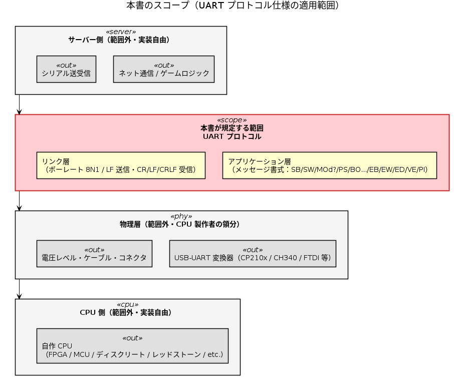
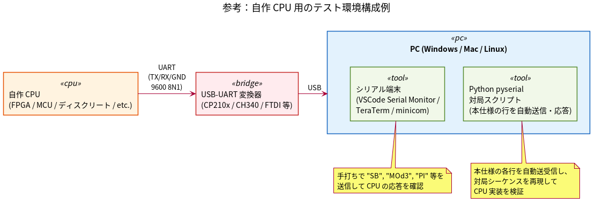
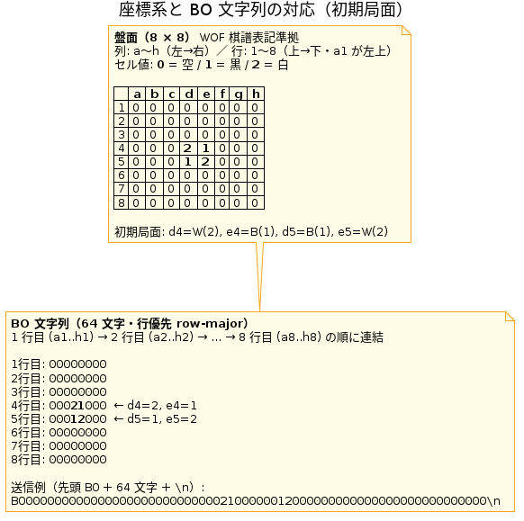
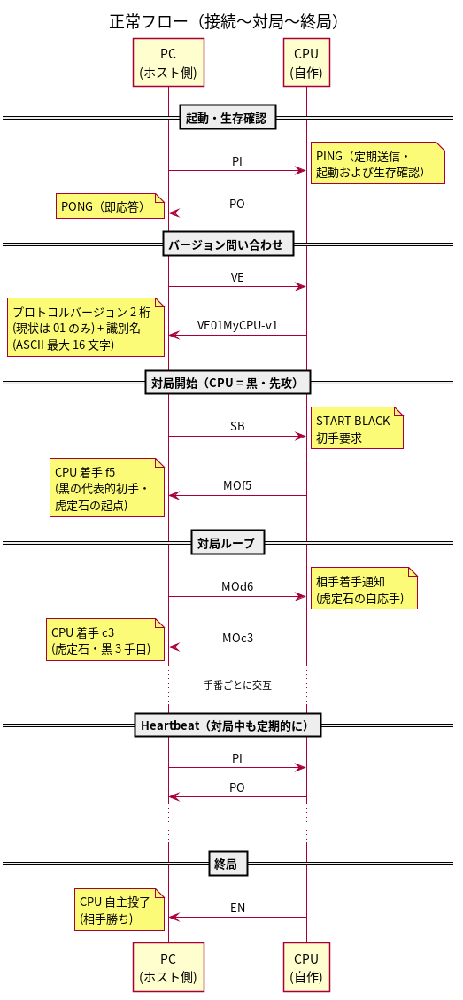
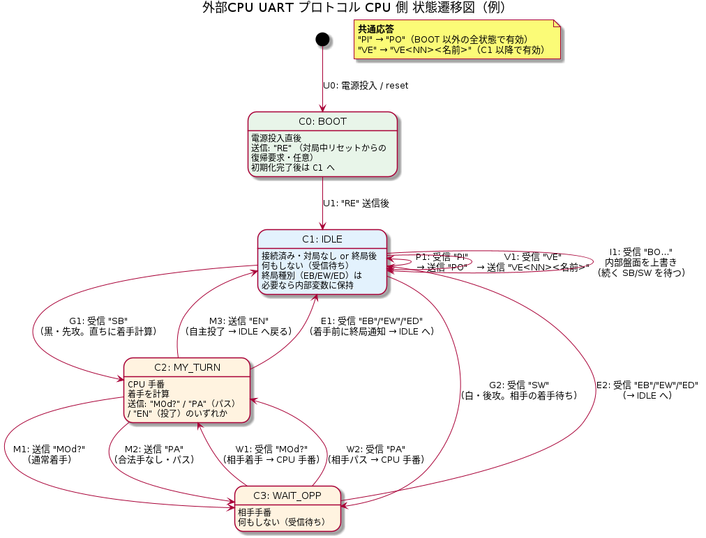
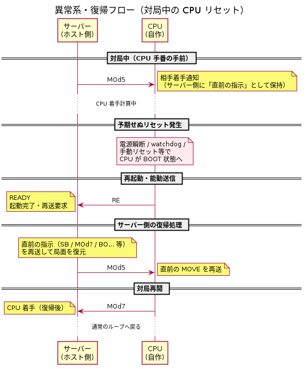

# リバーシ UART プロトコル仕様（ドラフト v0.1）

[English](README.md) | [日本語](README.ja.md)

2026-05-02

提案者: [tommie.jp](https://tommie.jp) ([@tommie-jp](https://github.com/tommie-jp))

- 自作 CPU を PC に UART で接続し、PC 上のソフトと通信するためのプロトコル仕様。
- 想定する CPU は、リバーシアルゴリズムを FPGA / ディスクリートなどに実装したもの。
- CPU 製作者が本書だけを読めば実装できるよう規定する。

> **注記**: 「オセロ」は株式会社メガハウスの登録商標です。本書では「オセロ」の
> 代わりに一般名詞である「リバーシ」を使用しています。

## 目次

- [リバーシ UART プロトコル仕様（ドラフト v0.1）](#リバーシ-uart-プロトコル仕様ドラフト-v01)
  - [目次](#目次)
  - [1. この文書のステータス](#1-この文書のステータス)
  - [2. スコープ](#2-スコープ)
  - [3. テスト環境構成例](#3-テスト環境構成例)
  - [4. リンク層](#4-リンク層)
  - [5. 文字コード・改行](#5-文字コード改行)
    - [5.1 仕様違反受信時の扱い](#51-仕様違反受信時の扱い)
  - [6. バッファ・タイムアウト](#6-バッファタイムアウト)
  - [7. メッセージ書式](#7-メッセージ書式)
    - [7.1 PC → CPU（CPU への入力）](#71-pc--cpucpu-への入力)
    - [7.2 CPU → PC（CPU からの応答）](#72-cpu--pccpu-からの応答)
    - [7.3 ER エラーコード表](#73-er-エラーコード表)
  - [8. 座標・盤面の向き](#8-座標盤面の向き)
  - [9. プロトコル設計の指針](#9-プロトコル設計の指針)
  - [10. 正常フロー](#10-正常フロー)
  - [11. CPU 側 状態遷移図（例）](#11-cpu-側-状態遷移図例)
  - [12. 状態遷移表](#12-状態遷移表)
  - [13. 異常系・復帰フロー](#13-異常系復帰フロー)
    - [13.1 盤面乖離からの復帰（`RS`）](#131-盤面乖離からの復帰rs)
  - [14. 参考](#14-参考)
    - [14.1 シリアル端末ソフト設定のヒント](#141-シリアル端末ソフト設定のヒント)
    - [14.2 設計判断の背景: なぜ「大文字コマンド」「CR+LF のみ」にしたか](#142-設計判断の背景-なぜ大文字コマンドcrlf-のみにしたか)
      - [大文字コマンド (§5)](#大文字コマンド-5)
      - [CR+LF のみ (§5)](#crlf-のみ-5)
      - [トレードオフ](#トレードオフ)
  - [15. 検討事項（未確定）](#15-検討事項未確定)
  - [16. 設計レビュー](#16-設計レビュー)
  - [17. 本書に追記を検討するなら](#17-本書に追記を検討するなら)

## 1. この文書のステータス

本書は**ドラフト v0.1** です。仕様は確定していません。ご意見・ご指摘を募集しています。

## 2. スコープ

本書が規定するのは **UART 上で流れるバイト列**（リンク層以上のアプリケーション
プロトコル）のみ。



PlantUML ソース: [scope.puml](scope.puml)

| レイヤ | 規定範囲 | 備考 |
| ------ | -------- | ---- |
| アプリケーション（メッセージ書式・状態遷移） | ✅ 本書 | |
| リンク層（ボーレート・バイト形式） | ✅ 本書 | |
| 物理層（USB-UART 変換器・電圧レベル・ケーブル・コネクタ） | ❌ 範囲外 | CPU 製作者の領分 |
| PC 側（端末ソフト等） | ❌ 範囲外 | PC 側の実装依存 |

**前提**: ホスト側 PC の USB ポートに USB-UART 変換器を挿し、その先の UART 線が
CPU と接続されている。バイト列が双方向に流れる状態までは物理的に成立している。

## 3. テスト環境構成例

自作 CPU 用のテスト環境は CPU 製作者が独自に用意してよい。典型的な構成例を下図に示す。



PlantUML ソース: [test-setup.puml](test-setup.puml)

- CPU → USB-UART 変換器 → PC の USB ポート、という物理接続を組む
- PC 側の端末ソフト（VSCode Serial Monitor / TeraTerm / minicom 等）で手動コマンドを
  投げて挙動確認するのが一般的
- シリアル送受信対局プログラムの例: Python pyserial を用いてシリアル送受信し、
  自動応答させて CPU の実装を検証する

## 4. リンク層

- **ボーレート**: 9600 / 38400 / 115200 bps などから選択（ホスト側で指定、CPU 側に合わせる）
- **フレーム**: 8N1（データ 8 bit、パリティなし、ストップ 1 bit）
- **フロー制御**: なし
- CPU 製作者は自分の CPU が安定動作する範囲でボーレートを選んでよい

## 5. 文字コード・改行

- ASCII（人間がシリアルモニタでデバッグできる）
- **改行は CR+LF (`\r\n`, 0x0D 0x0A) のみ**。送受信とも厳密に CR+LF。LF 単独 / CR 単独は不許可。
- **コマンドは大文字のみ**。`VE`, `PI`, `SB`, `MO`, `PA`, `BO`, `EB`, `EW`, `ED`, `PO`, `EN`, `RE`, `ER`, `ST`, `NC`, `RS`, `BS` の各キーワードは英大文字で送受信する。小文字 (`pi` 等) は仕様違反。
- **MO 等の座標は小文字のみ**（オセロ棋譜の慣習: `MOd3` は OK, `MOD3` は不可）
  - 列インデックス = `ch - 'a'`、行インデックス = `ch - '1'`

### 5.1 仕様違反受信時の扱い

上記規定に反する受信（小文字コマンド、改行コード違反、未知コマンド等）を受け取ったら、
ホスト・CPU ともに **`ER<NN>\r\n` で応答する**。`<NN>` は 2 桁エラーコード
（§7.3 エラーコード表参照、特定不能時は `00` Generic）。送り手は §7.2 #7 の規定通り
ログに記録するだけで、自動再送は行わない（無限ループ防止）。

FPGA 向け最小実装: 全違反を `ER00\r\n` で返すだけでも仕様適合。

## 6. バッファ・タイムアウト

| 項目 | 値 | 備考 |
| ---- | -- | ---- |
| CPU 側 RX バッファ | **80 バイト以上推奨** | 最長メッセージは `BO` (68 バイト) |
| 文字間タイムアウト | **100 ms** | 行途中で次文字が 100 ms 来なければパーサをリセットし、次の `\r\n` まで読み飛ばす |
| `PI`/`PO` ラウンドトリップ | PC 側は 1000 ms 待機、3 連続失敗で切断扱い | CPU 側は受信即応答 |
| 着手タイムアウト | PC 側で設定可（デフォルト 30 秒） | 超過時は PC 側で警告表示 |

## 7. メッセージ書式

凡例: 必須 = ✔ / 任意 = 空欄

### 7.1 PC → CPU（CPU への入力）

| # | 書式 | 必須 | 正式名称 | 意味 |
| -- | ---- | ---- | ---- | ---- |
| 1 | `SB\r\n` | ✔ | START BLACK | あなたは黒（先攻）。最初の手を指してください |
| 2 | `SW\r\n` | ✔ | START WHITE | あなたは白（後攻）。相手の手を待ってください |
| 3 | `MOd3\r\n` | ✔ | MOVE | 相手が d3 に置いた |
| 4 | `PA\r\n` | ✔ | PASS | 相手がパス |
| 5 | `BO[盤面状態64文字]\r\n` | | BOARD | 局面全体投入（**64 文字固定・行優先**。空きマスは `0`、黒 `1`、白 `2`。接続直後の同期・復帰時に使用。リセット復帰に対応しない CPU は無視してよい）。詳細は §8 座標・盤面の向きを参照。例: `BO0000000000000000000000000002100000012000000000000000000000000000\r\n` |
| 6 | `EB\r\n` | ✔ | END BLACK | 終局・黒勝ち |
| 7 | `EW\r\n` | ✔ | END WHITE | 終局・白勝ち |
| 8 | `ED\r\n` | ✔ | END DRAW | 終局・引分 |
| 9 | `VE\r\n` | ✔ | VERSION | バージョン問い合わせ。CPU は `VE<プロトコル版2桁><識別名>\r\n` で応答する（§7.2 #4 参照）。例: `VE01MyCPU-v1\r\n` |
| 10 | `PI\r\n` | ✔ | PING | ピング |

**`MO` の書式**: `MO` 直後は **必ず列 (`a`-`h`) + 行 (`1`-`8`) の 2 文字**。
スペース・区切り文字は挟まない（例: `MO d3` や `MOd-3` は不可）。
座標は小文字のみ受理（`MOd3` は OK、`MOD3` は不可。§5 参照）。

### 7.2 CPU → PC（CPU からの応答）

| # | 書式 | 必須 | 正式名称 | 意味 |
| - | ---- | ---- | ---- | ---- |
| 1 | `MOd3\r\n` | ✔ | MOVE | d3 に置く |
| 2 | `PA\r\n` | ✔ | PASS | パスする |
| 3 | `PO\r\n` | ✔ | PONG | `PI\r\n` への応答 |
| 4 | `VE<NN>[<名前>]\r\n` | ✔ | VERSION | `VE\r\n` への応答。`<NN>` は**プロトコルバージョン 2 桁 ASCII 数字固定** (`00`-`99`、先頭ゼロ必須、`VE1xxx` は不可)。`<名前>` は識別名 (ASCII printable 0x20-0x7E、0-16 文字、**省略可** — FPGA 向け最小実装は `VE01\r\n` のみでも OK)。当面は `01`（ドラフト v0.1）のみサポート。例: `VE01\r\n` / `VE01MyCPU-v1\r\n` |
| 5 | `EN\r\n` | | END | 投了 |
| 6 | `RE\r\n` | | READY | 起動完了。ホスト側は `RE` 受信で直前の指示を再送する（対局中のリセット復帰用。24/7 ボット運用では推奨） |
| 7 | `ER<NN>[ <reason>]\r\n` | | ERROR | 仕様違反受信への応答。`<NN>` は**エラーコード 2 桁 ASCII 数字固定** (`00`-`99`、§7.3 エラーコード表参照)。`<reason>` は任意 ASCII printable 文字列 (最大 64 文字、先頭スペース区切り、デバッグ用)。FPGA 向け最小実装は `ER00\r\n` (6 バイト) で OK。受信側は §5.1 の通りログ記録のみで自動再送しない |
| 8 | `ST<text>\r\n` | | STATUS | 思考中の状態を任意タイミングで送信。例: `ST d=12 n=45000\r\n`。PC 側は表示やログに使用。NBoard Protocol の `status` 相当。`<text>` は ASCII printable の自由形式テキスト。構造化データ（盤面スナップショット等）は別コマンド（§7.2 #11 `BS` 等）を使う |
| 9 | `NC<nodes>,<ms>\r\n` | | NODESTATS | 着手送信直後に探索統計を返す任意応答。例: `NC125000,450\r\n`（探索ノード数と所要ミリ秒）。NBoard Protocol の `nodestats` 相当 |
| 10 | `RS\r\n` | | REQUEST SYNC | 盤面再同期要求。CPU が自盤面とホスト盤面の乖離を検知した場合（例: ホストから届いた `MO?` が自盤面では非合法）に送る。ホスト側は現在の局面を `BO<盤面状態64文字>\r\n` で送信し、続けて**直前に送った指示**（通常は `MO?\r\n`）を再送する。詳細は §13 異常系・復帰フロー参照 |
| 11 | `BS<64char>\r\n` | | BOARD STATUS | CPU が保持している現在の盤面スナップショットを任意タイミングで通知。書式は `BO` と同じ（§8 行優先 64 文字、0=空 / 1=黒 / 2=白）。**報告のみで副作用なし**（PC 側は盤面突合・診断ログ・観戦用に使う）。`BO`（§7.1 #5 PC→CPU、盤面設定）と方向が逆の対。FPGA 最小実装では省略推奨 |

### 7.3 ER エラーコード表

`ER<NN>` の 2 桁コード一覧。送り手は該当する最も具体的なコードを使う。
特定不能な場合は `ER00` (Generic) を使ってよい。

| コード | 名称 | 発生例 |
| ---- | ---- | ---- |
| `00` | Generic / Unspecified | 汎用エラー (FPGA 最小実装で理由不特定のとき) |
| `01` | Unknown command | 未知コマンド (`XX\r\n` 等、§5.1) |
| `02` | Lowercase command | 小文字コマンド (`pi\r\n`, `Pi\r\n` 等、§5) |
| `03` | Line ending violation | CR+LF 以外の改行 (LF 単独 `PI\n`、CR 単独 `PI\r` 等、§5) |
| `04` | Invalid coordinate format | `MOz9`, `MO9d`, `MOD3` 等書式違反 (§8) |
| `05` | Illegal move | 合法手でない着手 (盤面論理違反、[検討事項.md §2](検討事項.md#2-無効な着手--不正応答への対応)) |
| `06` | Invalid protocol state | §12 状態遷移表で禁止された受信 (対局中の `SB` 等) |
| `07` - `29` | 予約 | 仕様拡張用、v0.2 以降で割当 |
| `30` - `99` | ユーザ定義 | 各 CPU 実装が自由に使える範囲 |

**FPGA 向け最小実装**: `ER00\r\n` 固定で送るだけでも仕様適合。受信側は個別コードの
意味を区別せず「何らかの違反があった」としてログに残して構わない。

**PC 実装のベストプラクティス**: 該当コード + 理由テキストで詳細化。
例: `ER04 MO expects lowercase coord, got 'MOD3'\r\n`

## 8. 座標・盤面の向き

オセロ棋譜の標準表記（世界オセロ連盟 WOF 流）に準拠する。

- **列**: `a`〜`h`（左→右）
- **行**: `1`〜`8`（上→下、`a1` が左上）
- **移動コマンド内の座標は小文字**（列 `a`〜`h`）で送信。例: `MOd3`, `MOh8`, `MOa1`
- 大文字も受理する（§5. 文字コード・改行参照）
- **BO の並び順**: 行優先で `a1, b1, c1, ... h1, a2, b2, ... h8` の 64 文字（= row-major、行 1 → 行 8）
- **初期局面**: `d4=W(2), e4=B(1), d5=B(1), e5=W(2)`（他はすべて空 `0`）
  → `0000000000000000000000000002100000012000000000000000000000000000`

CPU 内部の盤面表現（`row*8+col` / `col*8+row` / ビットボード等）は **実装者の自由**。
本書はワイヤ上のシリアライズ順のみを規定する。



PlantUML ソース: [board-coord.puml](board-coord.puml)

## 9. プロトコル設計の指針

- **1 行 1 メッセージ**。状態を持たないので CPU 側パーサが単純
- **CPU は受信内容を echo してはならない** — machine-to-machine プロトコルなので
  受信ストリームにエコーが混ざると解析が壊れる。ホスト側は万一 echo されても
  頑健にパースする
- **再送はしない** — CPU の応答待ちはタイムアウトまで黙って待つ
- **`RE\r\n`（READY）受信時**、ホスト側は直前の指示を再送する（起動タイミング吸収）。
  24/7 ボット運用で CPU が単独リセットした場合の復帰手段として重要
- **現在状態で無効なコマンド**（例: IDLE で `MOd?` 受信）は **黙って捨てる**
  （`\r\n` まで読み飛ばしてパーサリセット）。実装者の裁量で `ER\r\n`（任意、
  パラメータなし）を返してよい

## 10. 正常フロー

シリアル接続確立後の通信例。以下は `\r\n` 省略表記。

凡例:

- `>` CPU → PC
- `<` PC → CPU

```text
< PI                    PING（起動・生存確認）
> PO                    PONG
< VE                    VERSION 問い合わせ
> VE01MyCPU-v1     VERSION 応答（先頭 2 桁はプロトコルバージョン）
< SB                    START BLACK（黒先攻・初手要求）
> MOf5                   MOVE f5（CPU 着手・黒の代表的初手/虎定石の起点）
< MOd6                   MOVE d6（相手着手通知・虎定石の白応手）
  ...（以下、手番ごとに交互。PC は定期的に PI を挟み heartbeat 確認）
< PI
> PO
  ...
> EN                    END（CPU 投了・終局）
```

**起動検出は PI/PO 主導**。PC が能動的に `PI` を送り CPU が `PO` で応える構造
にしているため、シリアル接続のタイミングや CPU の起動順序に依存しない
（CPU 側は純粋リアクティブで実装できる）。



PlantUML ソース: [flow-normal.puml](flow-normal.puml)

## 11. CPU 側 状態遷移図（例）

以下の状態遷移は CPU 実装の **一例**。本書のプロトコル意味論（メッセージ書式・
タイミング要件）さえ満たせば、CPU 内部の状態表現は実装者の自由。

<!-- markdownlint-disable-next-line MD033 -->


PlantUML ソース: [state-external-cpu.puml](state-external-cpu.puml)

基本は純粋リアクティブ（PC からの受信に反応して返すだけ）。
能動送信は BOOT 直後の `RE\r\n`（対局中リセットからの復帰要求）のみ。

| 状態 | 役割 |
| ---- | ---- |
| C0: BOOT | 電源投入直後。`RE` 送信後に IDLE へ |
| C1: IDLE | 接続済み・対局なし or 終局後。`SB`/`SW` を待つ。終局種別（`EB`/`EW`/`ED`）が必要なら内部変数に保持 |
| C2: MY_TURN | CPU 手番。着手計算後 `MOd?` / `PA` / `EN` のいずれかを送信 |
| C3: WAIT_OPP | 相手手番。受信待ち |

**終局時の振る舞い**:

- CPU が `EN\r\n`（投了）を送信した場合、**PC は応答を返さず**次の `SB`/`SW`
  まで沈黙する。CPU は `EN` 送信後ただちに C1 (IDLE) へ遷移してよい
- PC 判定の終局（`EB`/`EW`/`ED`）を受信した場合も、CPU は C1 (IDLE) へ遷移し、
  次の `SB`/`SW` を待つ
- 終局種別（勝敗）を LED や LCD 等に表示したい場合、状態ではなく CPU 内部変数として保持する
  （プロトコル上は IDLE と区別しないため）

**共通応答（副作用なし）**:

- 受信 `PI` → 送信 `PO`（**全状態で有効**。BOOT 中を除き常に応答）
- 受信 `VE` → 送信 `VE<NN><名前>`（**C1 (IDLE) 以降で有効**。BOOT 中は応答しない。`<NN>` はプロトコルバージョン 2 桁）

> **注記（送受独立）**: UART の TX/RX は独立しており、CPU 側は送信中でも受信を取りこぼしてはならない。
> 例えば `VE<NN><名前>\r\n` を送出している最中にPC から `MOd?\r\n` が到着することがある。
> CPU は RX を割り込み／FIFO 等でバッファリングし、送信完了後に解釈すること
> （半二重プロトコルではない）。

**盤面同期**:

- 受信 `BO...` は **C1 (IDLE) でのみ** 受理し、内部盤面を上書き。続く `SB`/`SW` を待つ
  （接続直後の同期・リセット復帰時に使用。対局中は受理しない）
- **例外**: CPU が `RS\r\n` を能動送信した直後にホストから届く `BO...` は、対局中
  (C2 / C3) でも受理して盤面を上書きする。§13.1 盤面乖離からの復帰フローを参照

## 12. 状態遷移表

上の状態遷移図を **状態 × 受信イベント** のマトリクスで表したもの
（State Transition Table / Mealy マシン形式）。縦欄に CPU 側の状態、横欄に
PC から受信するメッセージを並べ、セルに「アクション ／ 遷移先」を書く。
実装者は状態ごとに「どのイベントで何をして、どの状態に行くか」を一覧できる。

| 状態 ＼ 受信 | `PI` | `VE` | `SB` | `SW` | `MOd?` | `PA` | `BO...` | `EB`/`EW`/`ED` |
| --- | --- | --- | --- | --- | --- | --- | --- | --- |
| C0: BOOT | —¹ | —¹ | —¹ | —¹ | —¹ | —¹ | —¹ | —¹ |
| C1: IDLE | 送 `PO` | 送 `VE 名` | →C2 | →C3 | — | — | 盤面上書き | — |
| C2: MY_TURN² | 送 `PO` | 送 `VE 名` | ※ | ※ | — | ※ | — | →C1 |
| C3: WAIT_OPP | 送 `PO` | 送 `VE 名` | ※ | ※ | 盤面更新 ／ →C2 | →C2 | — | →C1 |

**凡例**:

- `送 X`: メッセージ `X\r\n` を送信（留まる）
- `→Cn`: 状態 Cn へ遷移
- `—`: 黙って破棄（パーサをリセットして次の `\r\n` まで読み飛ばす。任意で `ER\r\n` を返してよい）
- `※`: **検討事項（未確定）** — §[15. 検討事項（未確定）](#15-検討事項未確定)参照

**注**:

- ¹ BOOT 中は任意の受信を破棄。CPU の初期化完了後に `RE\r\n` を能動送信して C1 (IDLE) へ遷移
- ² C2 (MY_TURN) は着手計算中の一時状態。計算完了後に CPU が自発的に
  `MOd?\r\n` / `PA\r\n` / `EN\r\n` を送信し、それぞれ C3 / C3 / C1 へ遷移する
  （受信イベントによる遷移ではなく、CPU 内部の自発遷移）
- SB/SW による対局開始時の手番割当: `SB` を受けたら黒（先攻）として C2 (MY_TURN) へ、
  `SW` を受けたら白（後攻）として C3 (WAIT_OPP) へ

## 13. 異常系・復帰フロー

対局中に CPU が予期せずリセットされた場合、CPU は起動直後に `RE\r\n` を能動送信する。
PC は `RE` を検知したら**直前に送った指示（`SB` / `MOd?` / `BO...` 等）を再送**
して局面を復元する。

```text
（対局中に CPU 電源リセット）
> RE                    READY（再起動完了・再送要求）
< MOd5                   PC が直前の MOVE を再送
> MOd7                   CPU 着手
  ...
```



PlantUML ソース: [flow-recovery.puml](flow-recovery.puml)

### 13.1 盤面乖離からの復帰（`RS`）

対局中に CPU が「ホストから届いた相手の `MO?` が自盤面では非合法」など、
**自盤面とホスト盤面の乖離**を検知した場合、CPU は `RS\r\n`（REQUEST SYNC）を
能動送信する。ホストは現在の局面を `BO<盤面状態64文字>\r\n` で送り、続けて
**直前に送った指示**（通常は相手の `MO?\r\n`）を再送する。

```text
（CPU が ホスト→CPU の MO?\r\n を自盤面で非合法と判定）
> RS                    REQUEST SYNC
< BO0000...             PC が現在の局面を送信
< MOb5                   PC が直前の MOVE を再送
  （CPU は BO で盤面を上書きしてから MO を処理）
> MOd7                   CPU 着手
  ...
```

`RS` は任意実装。CPU が盤面管理をホスト丸投げで行う実装（毎手 `BO` 同期）では
使わなくてよい。一方、CPU 側が独自に盤面を保持する実装では、PC 側バグや
ビット化け等による乖離から自律復帰できる手段として推奨する。

**再試行ポリシー（ホスト側）**: `RS` → `BO` + 指示再送で解消せず `RS` が連続して届く
場合、ホスト側は一定回数（例: 3 回）を上限に試行を打ち切って対局を中断してよい。

## 14. 参考

### 14.1 シリアル端末ソフト設定のヒント

§5 の「改行は CR+LF のみ」を反映するため、端末ソフトは CRLF モードで設定する。

| ソフト | 設定 |
| ---- | ---- |
| **VSCode Serial Monitor** | 改行コードを `CRLF` に設定 |
| **TeraTerm** | [設定] → [端末設定] → 改行コード: 受信=CR+LF、送信=CR+LF |
| **PuTTY** | [Terminal] → `Implicit CR in every LF` は OFF（送信データを変更しないため）。送信末尾は明示的に CR+LF を付ける |
| **minicom** (Linux/Mac) | `^A U` で改行モードを CR+LF にする（Add Carriage Return をオン） |
| **Arduino IDE シリアルモニタ** | 右下のプルダウンで `CR と LF の両方` を選択 |

いずれも既定が LF のみの場合があるので、CPU 実装者は初回接続時に設定を確認すること。
LF のみで送信すると §5.1 に従い CPU から `ER` が返る。

### 14.2 設計判断の背景: なぜ「大文字コマンド」「CR+LF のみ」にしたか

#### 大文字コマンド (§5)

- **FPGA / MCU 実装のシンプル化**: 受信バイトをそのままコマンド表と比較できる。
  `toupper()` 相当の回路/分岐が不要
- **可読性**: 端末モニタ表示で `PI`/`VE`/`MO` などがコマンドであることが一目で分かる。
  座標 `a1`-`h8` との区別も明確（コマンド=大文字、座標=小文字）
- **NBoard Protocol 等の慣習踏襲**: オセロ系プロトコルの多くは大文字コマンドを採用
- **タイプミス検出**: 小文字で送ると `ER` が即返ってくるので誤実装に早期に気付ける

#### CR+LF のみ (§5)

- **シリアル端末のデフォルトとの整合**: TeraTerm / PuTTY / Arduino IDE シリアルモニタ
  など主要端末ソフトは既定が CR+LF。手動デバッグ時に設定変更不要で繋がる
- **Enter キーの素の挙動と一致**: ほとんどの端末で Enter キーは CRLF を送出する。
  ユーザーが手打ちで `PI`+Enter と叩くだけで仕様通りのバイト列が流れるため、
  シリアルモニタでの一次デバッグが直感的
- **インターネット系テキストプロトコルの事実上の標準**: Telnet (RFC 854) を起点に、
  HTTP / SMTP / IRC / FTP コマンドチャネル等、ASCII ライン指向のワイヤフォーマットは
  歴史的に CRLF を採用してきた。本書もその慣習に従う
- **Windows ツールチェインとの親和性**: メモ帳・PowerShell・コマンドプロンプトを含め、
  Windows 系ツールはネイティブで CR+LF を扱う
- **オセロ系プロトコルとの並び**: NBoard Protocol など既存の Othello エンジン通信
  プロトコルとの整合（§17 参照）
- **行端検出の堅牢性**: `0x0D 0x0A` のシーケンスは ASCII テキスト中で出現しないため、
  単独 LF より誤検出に強い（バイナリ的なゴミ混入時の同期復帰がしやすい）。
  孤立 CR / 孤立 LF はそれだけで §5.1 違反のシグナルとして機能する
- **TX/RX 対称・単一ルール**: CPU 側もホスト側も「`\r\n` で確定、それ以外の改行は
  §5.1 違反」の単一ルールで実装できる。LF のみ規定だと「CR は混入禁止」の
  除外規則を別途明記しないと曖昧になる

#### トレードオフ

- **行端検出に状態遷移が必要**: FPGA 実装では `CR 受信→LF 待ち` の 1 段追加。
  ただし数ゲート規模で済む
- **1 バイト増**: `BO` 送信時 67 → 68 バイト。RX バッファ推奨値 80 バイト内に収まる
- **Unix 系ツール (`grep`/`sed`/`awk`) でログ閲覧時に行末の `^M` が見える**: 表示上の
  ノイズだが解析挙動には影響なし。`tr -d '\r'` で除去可
- **Git autocrlf 問題**: リポジトリにシリアルログや期待出力ファイル (§3 テスト環境構成例) を
  格納する場合、`.gitattributes` で当該ファイルを `binary` または `text eol=crlf`
  指定し、チェックアウト時の改行コード変換を抑止する必要がある

総合すると **既存ツールチェインとの整合性**・**手打ちデバッグの容易さ**・
**ASCII テキスト中で衝突しない行端シーケンス** のメリットが、FPGA 側のわずかな
実装負荷増を上回ると判断した。

## 15. 検討事項（未確定）

ドラフト段階で仕様が固まっていない項目は別ファイル
[検討事項.md](検討事項.md) を参照。実装者からのフィードバックを募集。

## 16. 設計レビュー

ドラフトに対する 4 つの視点（自作 CPU 作成者 / FPGA 制作者 / リバーシゲーマー /
PC 側実装者）からのレビュー結果は別ファイル [設計レビュー.md](設計レビュー.md) を参照。

## 17. 本書に追記を検討するなら

リバーシ／オセロ界隈の慣習・他プロトコルとの整合性を踏まえた、本書への
追記候補。

- **§14 参考に NBoard Protocol を追加**: 本書と同種の Othello エンジン通信プロトコル。
  CPU 製作者がもう一つの実装例として参照できると設計判断の納得感が上がる
- **§8 座標・盤面の向きに Thor 棋譜形式との互換性を明記**: `MOf5` の `f5` 部分は
  Thor 棋譜 DB（WOF 公式）の座標表記と一致する、という一文があると棋譜解析連携が
  しやすい
- **[検討事項.md](検討事項.md) に「定石名の自動検出」を追加**: 本書の責務に含めるか否か。
  結論としてはPC 側機能（CPU は定石名を知る必要がない）とするのが妥当だが、
  設計判断として一度触れておくと将来議論を蒸し返さずに済む
- **§9 プロトコル設計の指針に「持ち時間制御は本書の範囲外」を追加**: WOF 公式は
  30 分切れ負けや Fischer 加算などのルールがあるが、本書は 1 手タイムアウトの
  規定のみで、対局全体の時間管理は PC 側 / ルール層の責務
- **[検討事項.md](検討事項.md) に「Thor 形式棋譜のエクスポート」を追加**: 本プロトコルの結果を
  Thor 形式に変換してPC 側で保存するか。CPU とPC の境界をどこに引くか
- **★ NBoard Protocol との互換性強化**（詳細は [NBoard互換性検討.md](NBoard互換性検討.md) 参照）
  - ✅ **反映済み**: `ST<text>\r\n`（STATUS）、`NC<nodes>,<ms>\r\n`（NODESTATS）、
    `VE` 応答への `p<N>` プロトコルバージョン付加（いずれも CPU 側の任意実装）
  - 未反映（中〜高コスト）: `SD<n>`（探索深さ指定）、`HI<n>`（候補手問い合わせ）、
    `BH`（Thor 形式での履歴伝達）、GGF 互換モード
